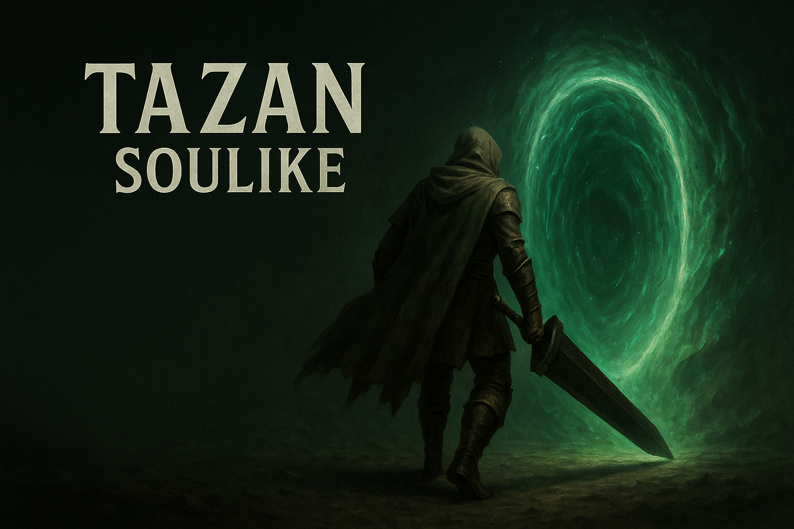

# Tazan.Source — source-only mirror

> 이 리포는 **소스 코드 전용 미러**입니다.
> 전체 프로젝트(에셋 포함)와 **풀 README**는 원본 리포에서 확인하세요:
> 👉 [Tazan (Main Repo)](https://github.com/chungheonLee0325/Tazan)

포함: `Source/`, `Config/`, `Plugins/*/Source`, `Tazan.uproject`, `Doc/`
제외: `Content/`, `Binaries/`, `Intermediate/`

---

<details><summary><b>Full README (from main repo)</b></summary>

# Tazan Project - 언리얼 C++ 소울라이크 게임 프로토타입

 

## 🎮 프로젝트 개요

'퍼스트 버서커: 카잔' 스타일의 전투 메커니즘을 심도 있게 학습하고 구현하는 것을 목표로 제작된 **3인칭 소울라이크 액션 게임 프로토타입**입니다. 

**언리얼 엔진 5** 환경에서 **C++를 적극적으로 활용**하여 객체 지향 설계 원칙에 따라 핵심 시스템을 구축했습니다. **컴포넌트 기반 설계**를 통해 캐릭터 기능을 모듈화하여 유지보수성을 높였으며, **데이터 테이블**을 이용한 데이터 주도 설계를 통해 게임 밸런스 및 콘텐츠 확장의 용이성을 확보했습니다.

* **장르:** 3인칭 소울라이크 액션
* **개발 기간:** 2025년 2월 (1개월)
* **개발 인원:** 프로그래밍 3명
* **참고 게임:** 퍼스트 버서커: 카잔, 다크 소울 시리즈, 엘든 링
* **주요 기술:** Unreal Engine 5, C++, Enhanced Input, Custom FSM, Data Tables

---

## ⚔️ 핵심 시스템 및 기술적 구현

### 🛡️ 소울라이크 전투 시스템
* **컴포넌트 기반 속성 관리**: `UHealthComponent`, `UStaminaComponent`, `UPoiseComponent`를 통한 모듈식 캐릭터 시스템
* **비트마스크 기반 상태 관리**: `EConditionBitsType` enum을 활용한 효율적인 캐릭터 상태 관리
* **타이밍 기반 Perfect 시스템**: 
  - Perfect Guard (0.1초 윈도우, 스태미나 소모 80% 감소)
  - Perfect Dodge (무적 프레임, 1.5배 데미지 버프)
* **강인도(Poise) 시스템**: 우선순위 기반 경직 판정 및 동적 강인도 보너스 적용
* **히트스탑 & 넉백**: `SetGlobalTimeDilation()`을 활용한 타격감 강화

### 🎯 고급 Lock-On 시스템
* **화면 중심 기반 타겟 선택**: `ProjectWorldToScreen()`을 활용한 3D→2D 좌표 변환
* **스마트 타겟 알고리즘**: 화면 중앙 거리(70%) + 실제 거리(30%) 가중평균으로 최적 타겟 선별
* **시야각 필터링**: `DotProduct` 계산으로 60도 시야각 내 타겟만 선별
* **부드러운 카메라 추적**: 거리 기반 동적 보간 속도 조절 (`FMath::RInterpTo`)

### 🤖 AI 시스템 (Custom FSM)
* **Template 기반 State Factory**: `CreateState<T>()` 메서드로 타입 안전한 AI State 생성
* **Builder Pattern 적용**: 상태 전이 로직을 선언적으로 설정 가능
* **상황 인식 스킬 룰렛**: 
  - 거리, 방향, 이전 스킬 타입을 고려한 동적 가중치 조절
  - 근/중/원거리별 적응적 스킬 선택 로직
* **AI Perception 연동**: `UAISenseConfig_Sight`를 통한 실시간 플레이어 감지

### ⚡ 고성능 충돌 시스템
* **프레임 간 보간**: 빠른 애니메이션에서의 충돌 누락 방지를 위한 다단계 보간 시스템
* **다양한 히트박스 지원**: Line, Sphere, Capsule, Box 트레이스 타입
* **AnimNotifyState 연동**: 정밀한 타이밍 제어를 위한 애니메이션-충돌 시스템 연계
* **멀티 히트박스**: `TMap<int, FAttackCollision>`을 통한 동시 다발 충돌 처리

### 📊 데이터 주도 설계
* **UDataTable 기반**: 코드 변경 없이 밸런스 조정 가능한 확장 가능한 구조(ex. 데이터 테이블 수정 만으로 플레이어/몬스터(AreaObject)의 체력, 강인도, 스태미나, 그로기 시간 변경 가능)
* **스킬 시스템 아키텍처**: `UBaseSkill` 상속 구조로 다양한 스킬 타입 지원
* **생명주기 관리**: `ESkillPhase` enum을 통한 체계적인 스킬 상태 관리

---

## 🎮 주요 기능 상세

### 플레이어 시스템
* **Enhanced Input System**: 상태 기반 입력 제한 및 차지 공격 구현
* **콤보 시스템**: `ComboNotifyState`를 통한 애니메이션 타이밍 기반 연계 공격
* **상태 머신**: 7가지 플레이어 상태(`EPlayerState`)에 따른 행동 제약 시스템

### 몬스터 AI
* **일반 몬스터**: 검 해골(Sword Skeleton), 할버드 맨(HalberdMan) - 기본 FSM 패턴
* **보스 몬스터**: 예투가(Yetuga) - 다중 페이즈, 복잡한 패턴, 특수 스킬 연계

### 스킬 시스템
* **상속 기반 구조**: `CollisionSkill`, `ComboSkill`, `ChargeSkill` 등 특화 구현
* **애니메이션 연동**: `AnimNotify`/`AnimNotifyState`를 통한 정교한 타이밍 제어
* **쿨타임 시스템**: 비동기 타이머 기반 스킬 재사용 대기시간 관리

---

## 🛠️ 기술 스택

**Core Engine & Language:**
- **Unreal Engine 5.5** - 게임 엔진
- **C++** - 핵심 게임플레이 로직, 시스템 아키텍처
- **Blueprint** - UI 로직, 애니메이션 상태 머신, 간단한 이벤트 처리

**주요 시스템:**
- **Enhanced Input** - 입력 처리 시스템
- **Animation Montage & Notify** - 정밀한 애니메이션 제어
- **UMG** - 사용자 인터페이스 (상태 바, 플로팅 데미지, 락온 마커)
- **Data Tables** - 데이터 주도 설계 및 밸런스 조정
- **AI Perception** - 적 AI 감지 및 행동 시스템
- **Custom FSM** - 몬스터 행동 상태 머신

---

## 📂 프로젝트 아키텍처
```
Tazan/
├── Animation/          # 애니메이션 시스템
│   ├── Common/        # 공통 AnimNotify/AnimNotifyState
│   ├── Monster/       # 몬스터 전용 애니메이션 로직
│   └── Player/        # 플레이어 애니메이션 인스턴스
├── AreaObject/         # 게임 엔티티 시스템
│   ├── AI/            # 커스텀 FSM 및 AI States
│   ├── Attribute/     # 컴포넌트 기반 속성 시스템
│   ├── Base/          # 기본 AreaObject 클래스
│   ├── Monster/       # 몬스터 클래스 및 AI Controller
│   ├── Player/        # 플레이어 캐릭터, 컨트롤러, Lock-On
│   ├── Skill/         # 스킬 시스템 아키텍처
│   └── Utility/       # 이동/회전 유틸리티 컴포넌트
├── Contents/           # 게임 프레임워크
├── Items/              # 아이템 시스템
├── ResourceManager/    # 데이터 타입 정의
├── UI/                 # UI 위젯 및 플로팅 데미지
└── Utilities/          # 공용 유틸리티 및 로그 시스템
```

---

## 💡 기술적 도전과 해결 과정

### 🏃‍♂️ 빠른 공격 충돌 누락 문제
**문제:** `EnableCollisionNotifyState`의 `Tick` 함수만으로는 빠른 애니메이션에서 충돌 판정 누락 발생

**해결:** 
- `FHitBoxData`에 `bUseInterpolation`, `InterpolationSteps` 옵션 추가
- 이전 프레임과 현재 프레임 위치 사이를 다단계 보간하여 Sweep 검사 수행
- `FMath::Lerp()`를 활용한 위치/회전 보간으로 정확도 향상

### 🧠 복잡한 AI 상태 관리
**문제:** 다양한 전투 상황에 따른 몬스터 행동 패턴 구현 시 상태 전이 로직 복잡화

**해결:**
- `UBaseSkillRoulette` 컴포넌트 도입으로 상황별 스킬 선택 로직 분리
- Template 기반 Factory Pattern으로 타입 안전한 State 생성
- Builder Pattern 적용으로 상태 전이 로직을 선언적으로 구성

### 🎯 정밀한 타이밍 시스템
**문제:** 애니메이션 진행에 따른 다양한 상태 적용 필요(이동 불가, 이동 가능, 퍼팩트 패리/회피, 콤보 공격 등)

**해결:**
- 비트마스크 기반 `EConditionBitsType`으로 다중 상태 효율적 관리
- 애니메이션 노티파이를 활용한 정밀한 시간 기반 상태 해제
- 델리게이트 시스템으로 상태 변화에 따른 이벤트 체이닝
- Animation Notify를 통한 다양한 상태 전이 구현
(ex. 공격 시작 -> 0.8 초 후 콤보 가능 상태 -> 1.0 초 후 콤보 불가능 상태 -> 1.3 다른 스킬 입력 가능 상태 -> 1.4 이동 가능 상태 -> 1.7 애니메이션 종료)

---

## 🎯 주요 조작키

| 기능 | 키 |
|------|-----|
| 이동 | W, A, S, D |
| 카메라 | 마우스 이동 |
| 약공격 | 마우스 왼쪽 버튼 |
| 강공격 (차지 가능) | 마우스 오른쪽 버튼 (누르고 있기) |
| 가드/패리 | Ctrl |
| 회피 | Space Bar |
| 락온 토글 | 마우스 휠 버튼 클릭 |
| 락온 타겟 전환 | 마우스 휠 스크롤 |
| HP 회복 | 1 |
| (사망 시) 부활 | ESC |

---

## ⚙️ 설치 및 실행 방법

### 요구 사양
- **Unreal Engine 5.5** 이상
- **Visual Studio 2022** (C++ 개발 도구 포함)
- **Windows 10/11** (x64)

### 빌드 과정
1. **프로젝트 파일 생성**
   ```
   Tazan.uproject 우클릭 → "Generate Visual Studio project files"
   ```

2. **솔루션 빌드**
   ```
   생성된 .sln 파일을 Visual Studio로 열기
   솔루션 탐색기에서 'Tazan' 프로젝트 → 빌드
   ```

3. **게임 실행**
   ```
   Unreal Editor에서 Tazan.uproject 열기
   Content/Maps/StartMap 레벨 로드
   Play 버튼으로 게임 시작
   ```

---

## 🚀 향후 개발 계획

### 성능 최적화
- **Object Pooling**: 플로팅 데미지, 투사체 등 빈번 생성 객체 최적화
- **메모리 관리**: 스마트 포인터 활용 및 순환 참조 제거
- **렌더링 최적화**: LOD 시스템 및 컬링 최적화

### 시스템 확장
- **아이템 & 장비 시스템**: 무기/방어구 장착 및 능력치 시스템
- **레벨 디자인**: 다양한 환경과 도전 과제
- **사운드 시스템**: 3D 오디오 및 동적 BGM

### 코드 품질 개선
- **매직 넘버 상수화**: 하드코딩된 수치의 설정 파일화
- **클래스 결합도 완화**: 인터페이스 기반 설계로 의존성 감소
- **테스트 자동화**: 유닛 테스트 및 통합 테스트 도입

---

## 👥 개발팀

| 역할 | 담당자 | 주요 기여 |
|------|-----|-----------|
| **메인 프로그래머** | 이충헌 | Base Class 구현, 플레이어 시스템, 스킬 시스템, 전투 시스템, Sword Skeleton, HalberdMan 구현 |
| **보스 AI 프로그래머** | 김희연 | Yetuga(보스 몬스터) AI와 스킬 룰렛 시스템 구현 |
| **레벨 디자이너** | 최연택 | 맵 디자인 및 환경 구성 |

---

## 📋 라이선스 및 참고 자료

이 프로젝트는 학습 목적으로 제작된 프로토타입으로, 상업적 사용을 목적으로 하지 않습니다.

**참고한 게임:**
- 퍼스트 버서커: 카잔 
- 다크 소울 시리즈 
- 엘든 링 

---

*본 프로젝트는 소울라이크 장르의 핵심 메카닉을 C++로 구현하면서 언리얼 엔진의 고급 기능들을 깊이 있게 활용한 기술 학습 프로젝트입니다. 객체 지향 설계 원칙과 게임 엔진 아키텍처에 대한 이해를 바탕으로 확장 가능하고 유지보수 가능한 게임 시스템을 구축하는 데 중점을 두었습니다.*

</details>

